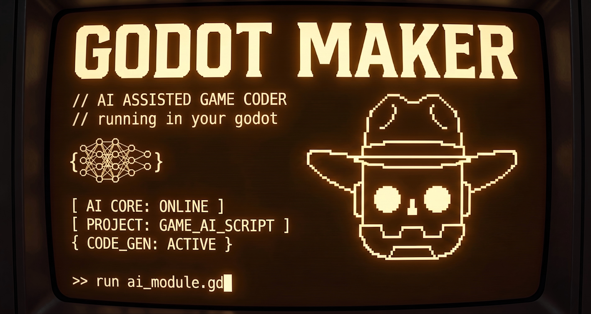

# GodotMaker

[简体中文](./README.zh-CN.md) | [English](./README.en.md)



`GodotMaker` 是一个面向 Godot 编辑器的 AI 游戏开发助手项目。它把 AI 对话、上下文引用、编辑器桥接和本地 Agent Service 组合在一起，让你可以直接在 Godot 里完成提问、分析、辅助编辑和场景操作。

## 项目简介

当前仓库由三部分组成：

- `addons/ksanadock`
	- 提供聊天面板、登录面板、个人资料面板、输出引用和上下文收集能力
- `addons/ksanadock_bridge`
	- 作为 Godot 编辑器插件启动本地 WebSocket Bridge，并负责与 Agent Service 通信
- `addons/ksanadock_bridge/service`
	- 基于 Node.js 的 Agent Service，负责 Agent Loop、工具注册、技能加载和任务处理

## 核心能力

- 在 Godot 编辑器内提供 AI Chat Dock
- 支持登录、会话刷新和基础用户资料展示
- 支持从脚本编辑器、文件系统和输出面板提取上下文发送给 AI
- 内置终端面板，方便在编辑器中查看和管理终端页签
- 通过 Bridge 将 AI 请求转发到本地 Agent Service
- 支持常见编辑器操作能力：
	- 读取场景树
	- 创建节点
	- 删除节点
	- 设置节点属性
	- 新建场景
	- 实例化场景
	- 保存场景
	- 搜索项目资产

## 当前状态

- 插件版本：`KsanaDock 0.1.0`
- Bridge 版本：`KsanaDock Bridge 0.1`
- 项目处于早期阶段，接口、配置方式和启动流程仍可能继续调整
- 当前 Bridge 的自动启动逻辑基于 `cmd.exe`，现阶段更适合在 Windows 环境中使用

## 环境要求

- Godot `4.6`
- Node.js 环境
- 可用的 `npx` 命令
- 可执行 `npx tsx`
- 能访问项目依赖的在线服务

如果你的环境里无法直接运行 `npx tsx`，需要先安装相应依赖后再启动 Agent Service。

## 快速开始

### 1. 获取项目

```bash
git clone https://github.com/KsanaDock/GodotMaker.git
cd GodotMaker
```

### 2. 安装 Agent Service 依赖

```bash
cd addons/ksanadock_bridge/service
npm install
```

### 3. 配置环境变量

复制 `addons/ksanadock_bridge/service/.env.example` 为 `.env`，并按需补充配置。

当前示例环境变量包含：

- `OPENROUTER_API_KEY`
- `SITE_URL`
- `SITE_NAME`

### 4. 用 Godot 打开项目

直接使用 Godot 打开仓库根目录下的 `project.godot`。

项目默认启用了以下两个编辑器插件：

- `res://addons/ksanadock/plugin.cfg`
- `res://addons/ksanadock_bridge/plugin.cfg`

如果你是将插件手动集成到自己的 Godot 项目中，请确认这两个插件都已启用。

### 5. 启动与连接

打开项目后，`KsanaDock Bridge` 会尝试自动：

- 启动本地 Agent Service
- 监听本地 `9080` 端口
- 通过 WebSocket 与 Agent Service 建立通信

Agent Service 当前使用如下方式启动：

```bash
npx tsx src/index.ts --project-root <你的项目目录>
```

如果自动启动失败，可以优先检查：

- `addons/ksanadock_bridge/service` 目录依赖是否已安装
- 本机是否可以执行 `npx tsx`
- 项目设置中的 `ksanadock/agent/service_path` 是否需要手动指定

## 使用方式

### AI 对话

- 在右侧 Dock 中打开 `Chat`
- 登录后即可发送自然语言请求
- 对话内容会通过 Bridge 转发到本地 Agent Service

### 上下文引用

- 可以从脚本编辑器中选中代码后通过右键菜单添加到对话
- 可以从输出面板抓取选中文本或剪贴板内容作为上下文
- 可以把文件、文本、代码片段一起拼装进一次提问中

### 场景与编辑器操作

Bridge 已暴露一组 Godot 编辑器操作接口，供 Agent 执行例如：

- 分析当前场景树
- 创建或删除节点
- 修改节点属性
- 创建新场景并保存
- 在项目中搜索资源文件

### 终端面板

- 底部面板提供多页签终端视图
- 可以新增、清空或关闭终端页签

## 目录结构

```text
GodotMaker/
├─ addons/
│  ├─ ksanadock/
│  │  ├─ api/
│  │  ├─ ui/
│  │  ├─ theme/
│  │  └─ plugin.cfg
│  └─ ksanadock_bridge/
│     ├─ service/
│     │  ├─ src/
│     │  ├─ skills/
│     │  └─ package.json
│     ├─ ksanadock_bridge.gd
│     └─ plugin.cfg
└─ project.godot
```

## 适用场景

- 在 Godot 编辑器内直接进行 AI 辅助开发
- 给脚本、输出日志和文件上下文添加自然语言说明
- 让本地 Agent 协助处理场景结构调整和资源检索
- 作为 AI 编辑器插件和 Godot Bridge 的实验型基础项目继续扩展

## 开源说明

- 仓库地址：<https://github.com/KsanaDock/GodotMaker.git>
- 许可证：MIT

## 致谢

- 感谢 Godot Engine 团队持续打造和维护一个开放、对创作者友好的游戏引擎。
- 感谢 `godogen` 项目作者在 Godot 相关工具和工作流方向上带来的启发。
